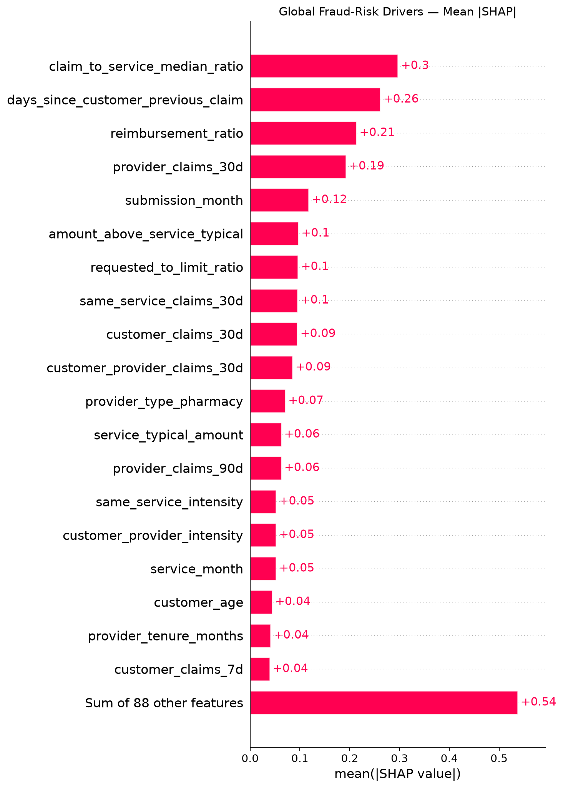
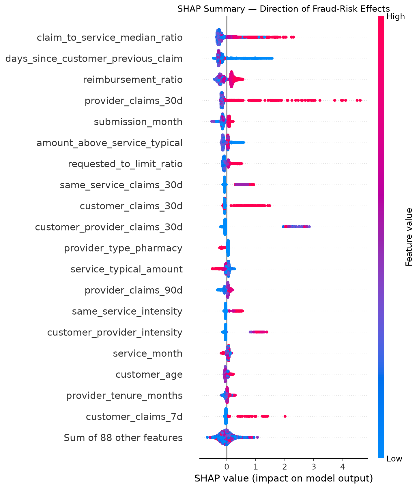

# Fraud-risk-model
# Health Insurance Fraud Risk Model

End-to-end machine learning system for **health insurance fraud investigation prioritization**, covering synthetic data generation, data-quality validation, temporal feature engineering, model selection, out-of-time evaluation, SHAP explainability, REST inference, Docker deployment and automated testing.

> **Status:** Portfolio / technical prototype built on synthetic data.  
> The model prioritizes claims for human investigation. It is **not** designed to automatically reject claims or determine that fraud occurred.

---

## Key Results

The final **XGBoost** model was evaluated on a fully held-out **2026 out-of-time test set**.

| Metric | Result |
|---|---:|
| Test claims | 14,176 |
| Fraud cases | 409 |
| Fraud prevalence | 2.885% |
| Average Precision | **0.5520** |
| ROC-AUC | **0.8518** |
| Brier Score | **0.0174** |
| Log Loss | **0.0797** |
| Precision @ top 3% | **51.64%** |
| Recall @ top 3% | **53.79%** |
| Lift @ top 3% | **17.90×** |
| Fraud amount captured @ top 3% | **55.15%** |

With investigators reviewing only the **3% highest-risk claims**, the model captures approximately:

- **53.8% of fraudulent claims**
- **55.1% of fraudulent claim amount**
- with a **17.9× lift** over untargeted review

in the synthetic out-of-time test environment.

---

## Business Problem

Health insurance fraud detection is a highly imbalanced classification problem.

When fraud represents only a small fraction of submitted claims, reviewing every claim is operationally inefficient. Conventional classification accuracy is therefore not an appropriate primary objective.

This project treats fraud detection primarily as a **risk-ranking and investigation-prioritization problem**.

```text
Incoming Claims
      ↓
Feature Construction
      ↓
Fraud Risk Scoring
      ↓
Risk Ranking
      ↓
Investigation Queue
      ↓
Human Review
      ↓
Final Decision
```

The primary operating point assumes that investigators can review approximately **3% of submitted claims**.

The objective is therefore to concentrate as much fraud as possible inside this limited investigation capacity.

---

## System Architecture

```text
Synthetic Data Generation
        ↓
Data Validation
        ↓
Data Cleaning
        ↓
Exploratory Data Analysis
        ↓
Temporal Feature Engineering
        ↓
Model Experiments
        ↓
Temporal Champion Selection
        ↓
Frozen XGBoost Model
        ↓
Out-of-Time Evaluation
        ↓
SHAP Explainability
        ↓
Reusable FraudScorer
        ↓
FastAPI
        ↓
Docker / Docker Compose
        ↓
Automated Tests
        ↓
GitHub Actions CI
```

The same frozen preprocessing pipeline and feature contract used during final model evaluation are reused during inference.

---

## Dataset

The project uses a configurable **synthetic health-insurance environment** designed specifically for fraud-model development.

The generated environment contains:

- customers
- insurance policies
- healthcare providers
- healthcare services
- claims and reimbursements
- submission information
- customer historical behaviour
- provider historical behaviour
- customer-provider interactions
- legitimate anomalous behaviour
- multiple fraud mechanisms
- multiple fraud difficulty levels
- controlled missingness
- intentionally invalid records
- temporal drift

### Dataset size

Initial generated claims:

```text
100,000
```

Claims remaining after data-quality cleaning:

```text
99,911
```

Rejected invalid claims:

```text
89
```

Final blocking data-quality errors:

```text
0
```

Invalid records are preserved separately instead of being silently corrected.

---

## Data Quality Pipeline

The synthetic dataset intentionally contains a small number of invalid observations to reproduce realistic data-engineering conditions.

Examples include:

- non-positive claim amounts
- invalid service-unit counts
- service dates occurring after submission dates

The cleaning pipeline validates these conditions and separates invalid records from the modelling population.

Controlled missingness remains intentionally present in selected fields and is handled explicitly during feature engineering.

---

## Temporal Validation Strategy

Random train/test splitting is deliberately avoided.

A fraud model deployed in practice learns from historical claims and scores **future claims**. The evaluation strategy therefore reproduces this temporal direction.

| Split | Period |
|---|---|
| Training | 2023-01-01 → 2025-06-30 |
| Validation | 2025-07-01 → 2025-12-31 |
| Final out-of-time test | 2026-01-01 → 2026-06-30 |

The final test set contains:

- **14,176 claims**
- **409 fraudulent claims**
- **2.885% fraud prevalence**

The 2026 test period remains untouched during model selection.

After champion selection, the preprocessing pipeline and final model are fitted on the combined training and validation population and evaluated once on the held-out test period.

---

## Leakage Control

Synthetic fraud generation requires variables that would not exist in a real scoring environment.

These variables are retained for simulation, diagnostics and evaluation but explicitly excluded from predictive modelling.

Examples include:

```text
latent_fraud_score
synthetic_fraud_probability
fraud_difficulty
fraud_mechanism
legitimate_anomaly
legitimate_anomaly_type
```

The target:

```text
is_fraud
```

is also excluded from the feature matrix.

Historical behavioural features are constructed using information preceding the current claim to reduce temporal leakage.

---

## Feature Engineering

The model uses several families of business and behavioural features.

### Claim features

Examples include:

- claim amount
- requested reimbursement
- reimbursement ratio
- service category
- service units
- submission channel
- documentation information

### Customer features

Examples include:

- customer age
- customer tenure
- coverage level
- customer behaviour segment

### Policy features

Examples include:

- policy tenure
- recent policy changes
- time since policy change

### Provider features

Examples include:

- provider type
- provider region
- provider tenure
- provider behaviour segment

### Historical behavioural features

Examples include:

- customer claims over 7 / 30 / 90 / 365 days
- historical customer claim amounts
- time since previous customer claim
- time since previous claim with the same provider
- repeated-service activity
- customer-provider interaction frequency
- provider claims over recent windows
- provider historical claim amounts

### Relative anomaly features

Examples include:

```text
claim_to_service_median_ratio
claim_to_customer_avg_ratio
claim_to_provider_avg_ratio
requested_to_limit_ratio
customer_provider_intensity
same_service_intensity
```

Relative anomaly features are particularly useful because suspicious behaviour often depends on deviation from an expected baseline rather than absolute amount alone.

---

## Model Development

Several model families were evaluated:

- Dummy classifier
- Logistic Regression
- class-balanced Logistic Regression
- Random Forest
- XGBoost

The Dummy model establishes a non-informative baseline.

Logistic Regression provides an interpretable linear benchmark.

Random Forest and XGBoost capture nonlinear relationships and interactions between behavioural features.

Model selection is performed using the **validation period only**.

The final champion model is:

> **XGBoost**

Final transformed matrix dimensions:

```text
Training + validation: 85,735 × 107
Final test:            14,176 × 107
```

---

## Final Out-of-Time Performance

### Global metrics

| Metric | Test Result |
|---|---:|
| Average Precision | **0.5520** |
| ROC-AUC | **0.8518** |
| Brier Score | **0.0174** |
| Log Loss | **0.0797** |

Because fraud prevalence is low, **Average Precision** is particularly important.

An Average Precision of **0.5520** is substantially above the approximately **2.9% fraud prevalence** of the test population.

---

## Operational Performance — Top 3% Review

The primary business operating point reviews the highest-risk **3% of claims**.

| Metric | Result |
|---|---:|
| Claims reviewed | **426** |
| True positives | **220** |
| False positives | **206** |
| False negatives | **189** |
| True negatives | **13,561** |
| Precision @ 3% | **51.64%** |
| Recall @ 3% | **53.79%** |
| Lift @ 3% | **17.90×** |
| Fraud amount captured @ 3% | **55.15%** |

This means that reviewing approximately **3% of claims** identifies more than half of the fraudulent claims in the synthetic test environment.

The model is therefore interpreted primarily as a **ranking system**, rather than as a classifier using an arbitrary probability threshold such as `0.50`.

---

## Investigation Capacity Trade-off

Model performance was evaluated across several investigation capacities.

| Review Rate | Precision | Recall | Lift | Fraud Amount Captured |
|---:|---:|---:|---:|---:|
| 0.5% | 98.59% | 17.11% | 34.17× | 16.93% |
| 1% | 94.37% | 32.76% | 32.71× | 32.83% |
| 2% | 68.31% | 47.43% | 23.68× | 48.66% |
| **3%** | **51.64%** | **53.79%** | **17.90×** | **55.15%** |
| 5% | 34.56% | 59.90% | 11.98× | 60.80% |
| 7.5% | 24.81% | 64.55% | 8.60× | 68.74% |
| 10% | 19.46% | 67.48% | 6.75× | 72.44% |
| 15% | 13.82% | 71.88% | 4.79× | 76.69% |

This illustrates the trade-off between investigation workload and fraud capture.

The **3% threshold is a business operating point**, not an intrinsic statistical threshold.

---

## Validation-to-Test Stability

| Metric | Validation | Test | Difference |
|---|---:|---:|---:|
| Average Precision | 0.4846 | 0.5520 | +0.0674 |
| ROC-AUC | 0.8451 | 0.8518 | +0.0067 |
| Brier Score | 0.0183 | 0.0174 | -0.0009 |
| Precision @ 3% | 46.53% | 51.64% | +5.12 pp |
| Recall @ 3% | 51.28% | 53.79% | +2.51 pp |
| Lift @ 3% | 17.08× | 17.90× | +0.82× |
| Fraud amount capture @ 3% | 49.07% | 55.15% | +6.08 pp |

No major degradation is observed between validation and the final out-of-time test period.

These results nevertheless originate from the same synthetic simulation framework and should not be interpreted as evidence of real-world production stability.

---

## Explainability

The frozen XGBoost model is analysed using **SHAP**.

The explainability pipeline covers:

- global feature importance
- business-level feature aggregation
- local claim explanations
- true-positive cases
- false-positive cases
- false-negative cases
- legitimate anomalies
- difficult fraud cases
- mechanism-specific failures

SHAP explanations are calculated on a representative sample of:

```text
5,000 test claims
```

The transformed model contains:

```text
107 model features
```

### Main business drivers

The five strongest business-level drivers are:

1. `claim_to_service_median_ratio`
2. `days_since_customer_previous_claim`
3. `reimbursement_ratio`
4. `provider_claims_30d`
5. `submission_month`

The strongest observed driver is:

```text
claim_to_service_median_ratio
```

This suggests that deviation of a claim amount from the historical amount expected for the corresponding service is an important model risk signal.

SHAP describes **model behaviour**, not causal relationships.

### Global SHAP importance



### SHAP distribution



---

## Error Analysis

Aggregate model metrics can hide important failure modes.

The project therefore performs dedicated false-positive, false-negative, fraud-mechanism and fraud-difficulty analysis.

### Recall by fraud mechanism at 3%

| Fraud Mechanism | Recall @ 3% |
|---|---:|
| Customer-provider pattern | **80.30%** |
| Repeated service | **68.97%** |
| Mixed pattern | **61.76%** |
| Frequency abuse | **57.75%** |
| Provider abnormality | **53.52%** |
| Amount inflation | **8.00%** |

The main observed model weakness is:

> **Amount inflation**

Among missed fraudulent claims, `amount_inflation` accounts for **69 false negatives**.

---

## Fraud Difficulty

Performance also varies according to the synthetic fraud-difficulty label.

| Difficulty | Median Risk Score | Recall @ 3% |
|---|---:|---:|
| Easy | 0.6707 | **67.26%** |
| Medium | 0.2050 | **55.45%** |
| Hard | 0.0261 | **28.95%** |

The expected ordering is preserved:

```text
Easy > Medium > Hard
```

Hard fraud therefore remains an important residual risk.

---

## False Positive Analysis

At the 3% operating point:

```text
206 legitimate claims
```

are selected for investigation.

Among these false positives:

```text
57.77%
```

correspond to simulated legitimate anomalies.

Examples include:

- repeated legitimate services
- unusual but legitimate provider behaviour
- legitimate high-frequency activity
- legitimate high-amount claims

This illustrates why model scores should support investigators rather than replace human judgement.

---

## False Negative Analysis

At the same operating point:

```text
189 fraudulent claims
```

are not selected for investigation.

The largest missed-fraud mechanism is:

```text
amount_inflation — 69 claims
```

Other missed mechanisms include:

- provider abnormality
- frequency abuse
- mixed patterns
- repeated services
- customer-provider patterns

These failure modes are explicitly documented rather than hidden behind aggregate performance metrics.

---

## Statistical Uncertainty

Bootstrap confidence intervals were estimated on the final test population.

### Average Precision

```text
Estimate: 0.5520
95% CI:   [0.5036, 0.6029]
```

### ROC-AUC

```text
Estimate: 0.8518
95% CI:   [0.8235, 0.8782]
```

These intervals quantify sampling uncertainty within the synthetic test population.

They do not capture uncertainty caused by differences between synthetic and real insurance data.

---

# Production-Style Inference

The frozen model is exposed through a reusable inference layer.

The scoring pipeline:

```text
Raw Claim
    ↓
Feature Contract Validation
    ↓
Feature Engineering
    ↓
Frozen Preprocessor
    ↓
Frozen XGBoost Model
    ↓
Fraud Probability
    ↓
Risk Ranking
```

The production-style scoring wrapper is implemented in:

```text
src/health_fraud/models/predict.py
```

The feature-construction pipeline is implemented in:

```text
src/health_fraud/features/build.py
```

---

## Batch Scoring

Claims can be scored from the command line using:

```bash
python scripts/score_claims.py
```

The script generates:

```text
artifacts/predictions/claim_scores.parquet
artifacts/predictions/top_review_claims.parquet
```

A complete scoring run on the cleaned dataset processes:

```text
99,911 claims
```

and generates a top-3% investigation queue.

---

# REST API

The trained model is exposed through a **FastAPI REST API**.

## Available Endpoints

| Method | Endpoint | Purpose |
|---|---|---|
| `GET` | `/` | Service information |
| `GET` | `/health` | API and model health |
| `GET` | `/model-info` | Frozen model metadata |
| `POST` | `/score` | Score one claim |
| `POST` | `/score-batch` | Score multiple claims |
| `POST` | `/top-review` | Return highest-risk investigation queue |
| `GET` | `/docs` | Swagger UI |
| `GET` | `/openapi.json` | OpenAPI specification |

### Example health response

```json
{
  "status": "ok",
  "model_loaded": true,
  "model_name": "XGBoost",
  "model_version": "1.0.0"
}
```

---

## Running the API Locally

### 1. Create a virtual environment

```bash
python -m venv .venv
```

Activate it:

```bash
source .venv/bin/activate
```

Install dependencies:

```bash
pip install -r requirements.txt
```

### 2. Start the API

```bash
PYTHONPATH=.:src python -m uvicorn api.app.main:app \
  --host 0.0.0.0 \
  --port 8000
```

Swagger documentation is then available at:

```text
http://localhost:8000/docs
```

Health endpoint:

```text
http://localhost:8000/health
```

---

# Docker

The API is fully containerized.

## Build

```bash
docker build -t health-fraud-api .
```

## Run

```bash
docker run --rm \
  -p 8000:8000 \
  --name health-fraud-api \
  health-fraud-api
```

---

## Docker Compose

The complete API can also be started using:

```bash
docker compose up --build -d
```

Check the container:

```bash
docker compose ps
```

Expected status:

```text
health-fraud-api   Up (...) (healthy)
```

Test the health endpoint:

```bash
curl -i http://127.0.0.1:8000/health
```

Stop the service:

```bash
docker compose down
```

The Docker Compose service includes an automated healthcheck against `/health`.

---

# Automated Tests

The repository contains automated API tests covering:

- health endpoint
- model metadata
- single-claim scoring
- batch scoring
- top-fraction investigation selection
- invalid review fraction handling
- missing feature handling

Run the complete test suite with:

```bash
PYTHONPATH=.:src python -m pytest api/tests tests -v
```

Current validated result:

```text
7 passed
```

---

# Continuous Integration

The project uses **GitHub Actions** for continuous integration.

The workflow runs automatically on pushes and pull requests targeting `main`.

```text
Git Push / Pull Request
        ↓
Checkout Repository
        ↓
Python 3.12
        ↓
Install Dependencies
        ↓
Compilation Checks
        ↓
pytest
        ↓
CI Pass / Fail
```

The latest validated workflow successfully passes the complete automated test suite.

Workflow definition:

```text
.github/workflows/tests.yml
```

---

# Project Structure

```text
.
├── .github/
│   └── workflows/
│       └── tests.yml
│
├── api/
│   ├── app/
│   │   ├── routers/
│   │   ├── services/
│   │   ├── dependencies.py
│   │   ├── main.py
│   │   └── schemas.py
│   └── tests/
│
├── artifacts/
│   ├── explainability/
│   ├── metadata/
│   ├── models/
│   ├── predictions/
│   └── preprocessors/
│
├── configs/
│   ├── data.yaml
│   ├── model.yaml
│   └── thresholds.yaml
│
├── data/
│   ├── interim/
│   ├── processed/
│   ├── raw/
│   └── synthetic/
│
├── docs/
│   ├── data_dictionary.md
│   ├── methodology.md
│   ├── model_card.md
│   └── problem_definition.md
│
├── notebooks/
│   ├── 01_data_understanding.ipynb
│   ├── 02_exploratory_data_analysis.ipynb
│   ├── 03_feature_analysis.ipynb
│   ├── 04_model_experiments.ipynb
│   ├── 05_model_evaluation.ipynb
│   └── 06_model_explainability.ipynb
│
├── scripts/
│   ├── clean_data.py
│   ├── evaluate_model.py
│   ├── generate_data.py
│   ├── score_claims.py
│   ├── train_model.py
│   └── validate_data.py
│
├── src/
│   └── health_fraud/
│       ├── business/
│       ├── data/
│       ├── evaluation/
│       ├── explainability/
│       ├── features/
│       └── models/
│
├── tests/
├── Dockerfile
├── docker-compose.yml
├── pyproject.toml
├── requirements.txt
└── README.md
```

---

# Reproducible Workflow

## Generate synthetic data

```bash
python scripts/generate_data.py --overwrite
```

## Validate generated data

```bash
python scripts/validate_data.py --data-dir data/synthetic
```

## Clean data

```bash
python scripts/clean_data.py
```

## Validate cleaned data

```bash
python scripts/validate_data.py --data-dir data/interim
```

## Score claims with the frozen model

```bash
python scripts/score_claims.py
```

## Run automated tests

```bash
PYTHONPATH=.:src python -m pytest api/tests tests -v
```

## Run with Docker Compose

```bash
docker compose up --build -d
```

---

# Model Governance

The model is designed around a human-in-the-loop workflow:

```text
Model
  ↓
Risk Ranking
  ↓
Investigation Queue
  ↓
Human Review
  ↓
Decision
```

The model should **not** independently:

- reject insurance claims
- accuse customers or providers of fraud
- infer criminal intent
- make legal conclusions
- replace fraud investigators

A high fraud-risk score means that a claim exhibits patterns the model associates with fraudulent observations.

It does **not** establish that fraud occurred.

---

# Monitoring Strategy

A real production deployment should monitor four main dimensions.

### Data Quality

- missing-value rates
- schema changes
- invalid values
- categorical-domain changes
- unexpected distributions

### Data Drift

Monitor changes in important variables such as:

- claim amount
- reimbursement ratio
- service mix
- provider activity
- customer activity
- claim-to-service ratio

### Model Performance

Once labels become available:

- Average Precision
- ROC-AUC
- Precision@K
- Recall@K
- Lift@K
- fraud amount captured
- calibration

### Operational Performance

- investigation volume
- confirmed-fraud yield
- false-positive burden
- investigation capacity
- fraud amount recovered or prevented

---

# Known Limitations

The most important limitation is that the entire modelling environment is **synthetic**.

Real-world insurance data may contain:

- different fraud mechanisms
- stronger behavioural heterogeneity
- coding inconsistencies
- different missing-data mechanisms
- provider networks
- geographic effects
- coordinated fraud rings
- investigation feedback loops
- changing fraud strategies
- regulatory constraints

Reported performance therefore demonstrates the **machine-learning and engineering methodology**, not expected performance on real insurance claims.

Additional observed limitations include:

- weak detection of simulated `amount_inflation`
- lower recall on hard fraud
- legitimate anomalies producing false positives
- potential concept drift
- SHAP explanations being associative rather than causal

A real deployment would require independent validation on representative insurance data, security controls, access governance, monitoring and regulatory review.

---

# Technology Stack

### Machine Learning

`Python` · `pandas` · `NumPy` · `scikit-learn` · `XGBoost`

### Explainability

`SHAP`

### Data

`Parquet` · `PyArrow`

### API

`FastAPI` · `Pydantic` · `Uvicorn`

### Testing

`pytest`

### Deployment

`Docker` · `Docker Compose`

### CI/CD

`GitHub Actions`

---

# Documentation

Detailed project documentation is available in:

- [`docs/problem_definition.md`](docs/problem_definition.md)
- [`docs/data_dictionary.md`](docs/data_dictionary.md)
- [`docs/methodology.md`](docs/methodology.md)
- [`docs/model_card.md`](docs/model_card.md)

The model card contains the complete discussion of:

- intended use
- evaluation methodology
- leakage controls
- model performance
- explainability
- failure modes
- uncertainty
- human oversight
- monitoring
- retraining
- prohibited uses

---

# Disclaimer

This repository is an **educational and portfolio project using synthetic insurance data**.

It is not a production fraud-detection system and should not be used to make decisions about real insurance claims, customers or healthcare providers.
